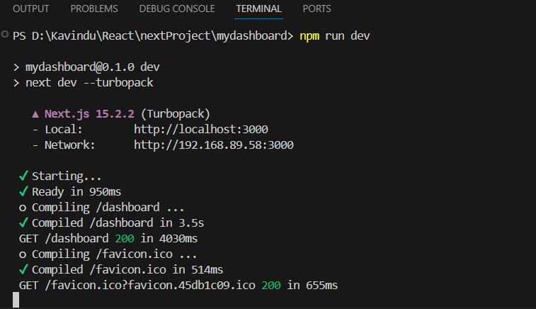

1.
2.
This is how my package.json looks loke ,
{
  "name": "mydashboard",
  "version": "0.1.0",
  "private": true,
  "scripts": {
    "dev": "next dev --turbopack",
    "build": "next build",
    "start": "next start",
    "lint": "next lint"
  },
  "dependencies": {
    "ky": "^1.7.5",
    "next": "15.2.2",
    "react": "^19.0.0",
    "react-dom": "^19.0.0"
  },
  "devDependencies": {
    "@eslint/eslintrc": "^3",
    "@tailwindcss/postcss": "^4",
    "eslint": "^9",
    "eslint-config-next": "15.2.2",
    "tailwindcss": "^4"
  }
}

There i can get name of my project , version . In the script section i can see the custom commands that run using npm . for example I run using "nvm run dev" is runs on the developer server where i can see get 200 commands on the terminal . However if i run "npm run build" it runs the production server where nothing can be seen on the terminal while running. lint is used to ESlint to check errors

in dependencies it shows main libraries you need to run the project . In devDependencies it shows the tools you to develop the project but not for production.

The package-lock.json file is automatically generated when you install dependencies using npm install. Its main purpose is to lock the exact versions of dependencies . This is means until you manually update or install any package package-lock.json keeps the existing package locked.

4. 
Node.js is required to run next.js development server and production server . Node.js comes with npm (Node Package Manager), which allows you to install, update, and manage the required JavaScript libraries .

npm run lint - It check whether there is an error in the code
npn run dev - it runs the project on the development server 
npm run build - it runs the project on the production server.

5.
dependncies are required for the project to run properly .
     "dependencies": {
    "ky": "^1.7.5",
    "next": "15.2.2",
    "react": "^19.0.0",
    "react-dom": "^19.0.0"
  },

  ky - for API reuest
  next -  Next.js framework for SSR, SSG, and routing.
  react - required when rendering react components

but devdepencies are required only for development purposes not for production.
      "devDependencies": {
    "@eslint/eslintrc": "^3",
    "@tailwindcss/postcss": "^4",
    "eslint": "^9",
    "eslint-config-next": "15.2.2",
    "tailwindcss": "^4"
  }

eslint - to check errors
tailwindcss - for styling the page 

React was created by jordon walke while he is working in facebook wjich is now meta . It was first came in as "F-Bolt" then changing it to "FaxJs" It was first deployed in 2011. 

Dan abromov also played a key role in  popularizing react by giving speeches when react was in its inital stage .he was one of the early react uses.

6.
Please refer the images .

